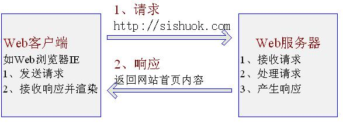
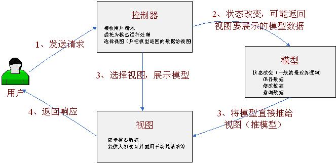
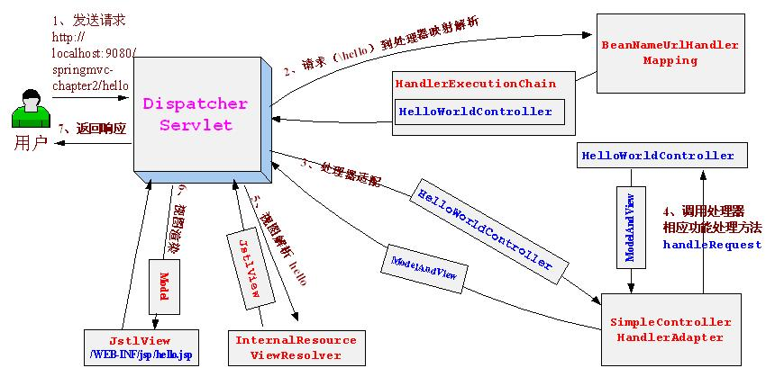

# 1 Web MVC简介

## 1.1、Web开发中的请求-响应模型：

http://pp5tb1vb6.bkt.clouddn.com/0e6f91933a9640849ccfd0dad09d9a84.jpg
在Web世界里，具体步骤如下：

1、  Web浏览器（如IE）发起请求，如访问[http://sishuok.com](http://sishuok.com/)

2、  Web服务器（如Tomcat）接收请求，处理请求（比如用户新增，则将把用户保存一下），最后产生响应（一般为html，其实返回的就是视图View）。

3、web服务器处理完成后，返回内容给web客户端（一般就是我们的浏览器），客户端对接收的内容进行处理（如web浏览器将会对接收到的html内容进行渲染以展示给客户）。

## 1.2、标准MVC模型概述

**MVC**模型：是一种架构型的模式，本身不引入新功能，只是帮助我们将开发的结构组织的更加合理，使展示与模型分离、流程控制逻辑、业务逻辑调用与展示逻辑分离。



**首先让我们了解下MVC（Model-View-Controller）三元组的概念：**

**Mode（模型）：**数据模型，提供要展示的数据，因此包含数据和行为，可以认为是领域模型或JavaBean组件（包含数据和行为），不过现在一般都分离开来：Value Object（数据） 和 服务层（行为）。也就是模型提供了模型数据查询和模型数据的状态更新等功能，包括数据和业务。

**View（视图）：**负责进行模型的展示，一般就是我们见到的用户界面，客户想看到的东西。

**Controller（控制器）：**接收用户请求，委托给模型进行处理（状态改变），处理完毕后把返回的模型数据返回给视图，由视图负责展示。 也就是说控制器做了个调度员的工作。

**注**：在标准的MVC中模型能主动推数据给视图进行更新（观察者设计模式，在模型上注册视图，当模型更新时自动更新视图），但在Web开发中模型是无法主动推给视图（无法主动更新用户界面），因为在Web开发是请求-响应模型。

## 1.3、Web MVC概述

Web MVC标准架构


在Web MVC模式下，模型无法主动推数据给视图，如果用户想要视图更新，需要再发送一次请求（即请求-响应模型）。

# 2 Spring Web MVC

## 2.1 Spring Web MVC是什么

Spring Web MVC是一种基于Java的实现了Web MVC设计模式的请求驱动类型的轻量级Web框架，即使用了MVC架构模式的思想，将web层进行职责解耦，基于请求驱动指的就是使用请求-响应模型，框架的目的就是帮助我们简化开发，Spring Web MVC也是要简化我们日常Web开发的。

Spring Web MVC：

==前端控制器==是`DispatcherServlet；`

==应用控制器==其实拆为**处理器映射器**(Handler Mapping)进行处理器管理和**视图解析器**(View Resolver)进行视图管理；

==页面控制器/处理器==为Controller接口（仅包含`ModelAndView handleRequest(request, response)` 方法）的实现（也可以是任何的POJO类）；支持本地化（Locale）解析、主题（Theme）解析及文件上传等；提供了非常灵活的数据验证、格式化和数据绑定机制；提供了强大的约定大于配置（惯例优先原则）的契约式编程支持。

## 2.2 Spring Web MVC能帮我们做什么

√让我们能非常简单的设计出干净的Web层和薄薄的Web层；

√进行更简洁的Web层的开发；

√天生与Spring框架集成（如==IoC容器、AOP==等）；

√提供强大的约定大于配置的契约式编程支持；

√能简单的进行Web层的单元测试；

√支持灵活的URL到页面控制器的映射；

√非常容易与其他视图技术集成，如Velocity、FreeMarker等等，因为模型数据不放在特定的API里，而是放在一个Model里（`Map`数据结构实现，因此很容易被其他框架使用）；

√非常灵活的数据验证、格式化和数据绑定机制，能使用任何对象进行数据绑定，不必实现特定框架的API；

√提供一套强大的JSP标签库，简化JSP开发；

√支持灵活的本地化、主题等解析；

√更加简单的异常处理；

√对静态资源的支持；

√支持Restful风格。

## 2.3、Spring Web MVC架构

Spring Web MVC框架也是一个基于请求驱动的Web框架，并且也使用了前端控制器模式来进行设计，再根据请求映射规则分发给相应的页面控制器（动作/处理器）进行处理。首先让我们整体看一下Spring Web MVC处理请求的流程：

### 2.3.1、Spring Web MVC处理请求的流程


具体执行步骤如下：

1、  首先用户发送请求————>前端控制器，前端控制器根据请求信息（如URL）来决定选择哪一个页面控制器进行处理并把请求委托给它，即以前的控制器的控制逻辑部分；图中的1、2步骤；

2、  页面控制器接收到请求后，进行功能处理，首先需要收集和绑定请求参数到一个对象，这个对象在Spring Web MVC中叫**命令对象**，并进行验证，然后将命令对象委托给业务对象进行处理；处理完毕后返回一个==ModelAndView==（**模型数据和逻辑视图名**）；图中的3、4、5步骤；

3、  前端控制器收回控制权，然后根据返回的**逻辑视图名**，选择相应的视图进行渲染，并把模型数据传入以便视图渲染；图中的步骤6、7；

4、  前端控制器再次收回控制权，将响应返回给用户，图中的步骤8；至此整个结束。

### 问题：

1、  请求如何给前端控制器？

2、  前端控制器如何根据请求信息选择页面控制器进行功能处理？

3、  如何支持多种页面控制器呢？

4、  页面控制器如何使用业务对象？

5、  页面控制器如何返回模型数据？

6、  前端控制器如何根据页面控制器返回的逻辑视图名选择具体的视图进行渲染？

7、  不同的视图技术如何使用相应的模型数据？

### 2.3.2、Spring Web MVC架构


架构图对应的DispatcherServlet核心代码如下：

```java
//前端控制器分派方法 
protected void doDispatch(HttpServletRequest request, HttpServletResponse response) throws Exception {
    HttpServletRequest processedRequest = request;
    HandlerExecutionChain mappedHandler = null;
    boolean multipartRequestParsed = false;
    WebAsyncManager asyncManager = WebAsyncUtils.getAsyncManager(request);

    try {
        try {
            ModelAndView mv = null;
            Exception dispatchException = null;

            try {
              //步骤1、检查请求是否是multipart（如文件上传），如果是将通过MultipartResolver解析 
                processedRequest = this.checkMultipart(request);
                multipartRequestParsed = processedRequest != request;
              //步骤2、请求到处理器（页面控制器）的映射，通过HandlerMapping进行映射，返回的是HandlerExecutionChain对象(包含一个Handler处理器（页面控制器）对象、多个HandlerInterceptor拦截器对象)
                mappedHandler = this.getHandler(processedRequest);
                if (mappedHandler == null || mappedHandler.getHandler() == null) {
                    this.noHandlerFound(processedRequest, response);
                    return;
                }
 //步骤3、处理器适配，即 将我们的处理器包装成相应的适配器（从而支持多种类型的处理器） 
                HandlerAdapter ha = this.getHandlerAdapter(mappedHandler.getHandler());
                String method = request.getMethod();
                boolean isGet = "GET".equals(method);
                if (isGet || "HEAD".equals(method)) {
                    long lastModified = ha.getLastModified(request, mappedHandler.getHandler());
                    if (this.logger.isDebugEnabled()) {
                        this.logger.debug("Last-Modified value for [" + getRequestUri(request) + "] is: " + lastModified);
                    }

                    if ((new ServletWebRequest(request, response)).checkNotModified(lastModified) && isGet) {
                        return;
                    }
                }
                //执行拦截器的preHandle()方法
                if (!mappedHandler.applyPreHandle(processedRequest, response)) {
                    return;
                }
               // 步骤4、由适配器执行处理器（调用处理器相应功能处理方法），其实就是执行接口Controller中的handleRequest()方法 ，返回的是ModelAndView对象，随后会经过渲染，获得交给用户的HTML页面
                mv = ha.handle(processedRequest, response, mappedHandler.getHandler());
                if (asyncManager.isConcurrentHandlingStarted()) {
                    return;
                }
                //设置View（视图）名，供随后的视图解析器使用
                this.applyDefaultViewName(processedRequest, mv);
              //执行拦截器的postHandle()方法
                mappedHandler.applyPostHandle(processedRequest, response, mv);
            } catch (Exception var19) {
                dispatchException = var19;
            }
//步骤5 步骤6、解析视图并进行视图的渲染  
//步骤5 由ViewResolver解析View（viewResolver.resolveViewName(viewName, locale)）  
//步骤6 视图在渲染时会把Model传入（view.render(mv.getModelInternal(), request, response);）
          //下面有具体解释
            this.processDispatchResult(processedRequest, response, mappedHandler, mv, dispatchException);
        } catch (Exception var20) {
          //执行拦截器的afterCompletion()方法
            this.triggerAfterCompletion(processedRequest, response, mappedHandler, var20);
        } catch (Error var21) {
            this.triggerAfterCompletionWithError(processedRequest, response, mappedHandler, var21);
        }

    } finally {
        if (asyncManager.isConcurrentHandlingStarted()) {
            if (mappedHandler != null) {
                mappedHandler.applyAfterConcurrentHandlingStarted(processedRequest, response);
            }
        } else if (multipartRequestParsed) {
            this.cleanupMultipart(processedRequest);
        }

    }
}
private void processDispatchResult(HttpServletRequest request, HttpServletResponse response, HandlerExecutionChain mappedHandler, ModelAndView mv, Exception exception) throws Exception {
    boolean errorView = false;
    if (exception != null) {
        if (exception instanceof ModelAndViewDefiningException) {
            this.logger.debug("ModelAndViewDefiningException encountered", exception);
            mv = ((ModelAndViewDefiningException)exception).getModelAndView();
        } else {
            Object handler = mappedHandler != null ? mappedHandler.getHandler() : null;
            mv = this.processHandlerException(request, response, handler, exception);
            errorView = mv != null;
        }
    }
//关键：上接步骤5、6
    if (mv != null && !mv.wasCleared()) {
      //-------
        this.render(mv, request, response);
        if (errorView) {
            WebUtils.clearErrorRequestAttributes(request);
        }
    } else if (this.logger.isDebugEnabled()) {
        this.logger.debug("Null ModelAndView returned to DispatcherServlet with name '" + this.getServletName() + "': assuming HandlerAdapter completed request handling");
    }

    if (!WebAsyncUtils.getAsyncManager(request).isConcurrentHandlingStarted()) {
        if (mappedHandler != null) {
            mappedHandler.triggerAfterCompletion(request, response, (Exception)null);
        }

    }
}
//继续跟进解析视图和渲染  
protected void render(ModelAndView mv, HttpServletRequest request, HttpServletResponse response) throws Exception {
        Locale locale = this.localeResolver.resolveLocale(request);
        response.setLocale(locale);
        View view;
        if (mv.isReference()) {
          //这里开始进行视图的解析，下有对应方法
          // We need to resolve the view name.
            view = this.resolveViewName(mv.getViewName(), mv.getModelInternal(), locale, request);
            if (view == null) {
                throw new ServletException("Could not resolve view with name '" + mv.getViewName() + "' in servlet with name '" + this.getServletName() + "'");
            }
        } else {
            view = mv.getView();
            if (view == null) {
                throw new ServletException("ModelAndView [" + mv + "] neither contains a view name nor a " + "View object in servlet with name '" + this.getServletName() + "'");
            }
        }

        if (this.logger.isDebugEnabled()) {
            this.logger.debug("Rendering view [" + view + "] in DispatcherServlet with name '" + this.getServletName() + "'");
        }

        try {
          //这里开始进行视图的渲染，使用的是View的render(Map<String, ?> model, HttpServletRequest var2, HttpServletResponse var3)方法
            view.render(mv.getModelInternal(), request, response);
        } catch (Exception var7) {
            if (this.logger.isDebugEnabled()) {
                this.logger.debug("Error rendering view [" + view + "] in DispatcherServlet with name '" + this.getServletName() + "'", var7);
            }

            throw var7;
        }
    }
//解析视图名
    protected View resolveViewName(String viewName, Map<String, Object> model, Locale locale, HttpServletRequest request) throws Exception {
        Iterator var5 = this.viewResolvers.iterator();

        View view;
        do {
            if (!var5.hasNext()) {
                return null;
            }
//与上面步骤5的解析视图对应上，使用的是ViewResolver.resolveViewName(String var1, Locale var2)方法
            ViewResolver viewResolver = (ViewResolver)var5.next();
            view = viewResolver.resolveViewName(viewName, locale);
        } while(view == null);

        return view;
    }
```

核心架构的具体流程步骤如下：

1、  首先用户发送请求——>DispatcherServlet，前端控制器收到请求后自己不进行处理，而是委托给其他的解析器进行处理，作为统一访问点，进行全局的流程控制；

2、  DispatcherServlet——>HandlerMapping， **HandlerMapping将会把请求映射为(执行的是HandlerMapping接口中getHandler方法)HandlerExecutionChain对象**（**==包含一个Handler处理器（页面控制器）对象、多个HandlerInterceptor拦截器==**）对象，通过这种**==策略模式==**，很容易添加新的映射策略；

3、  DispatcherServlet——>HandlerAdapter，==HandlerAdapter将会把处理器包装为适配器==，从而支持多种类型的处理器，即==**适配器设计模式**==的应用，从而很容易支持很多类型的处理器；

4、  HandlerAdapter——>处理器功能处理方法的调用，HandlerAdapter将会根据适配的结果调用真正的处理器的功能处理方法（其实就是实现类中实现Controller接口中的handleRequest方法），完成功能处理；并返回一个ModelAndView对象（包含模型数据、逻辑视图名）；

5、  ModelAndView的逻辑视图名——> ViewResolver，ViewResolver将把逻辑视图名解析为具体的View，**通过这种策略模式，很容易更换其他视图技术**；

6、  View——>渲染，View会根据传进来的Model模型数据进行渲染，此处的Model实际是一个Map数据结构，因此很容易支持其他视图技术；

7、返回控制权给DispatcherServlet，由DispatcherServlet返回响应给用户，到此一个流程结束。

###到此，再来看我们前边提出的问题：

 1、  请求如何给前端控制器？这个应该在web.xml中进行部署描述，在HelloWorld中详细讲解。

2、  前端控制器如何根据请求信息选择页面控制器进行功能处理？ 我们需要配置HandlerMapping进行映射

3、  如何支持多种页面控制器呢？配置HandlerAdapter从而支持多种类型的页面控制器

4、  页面控制器如何使用业务对象？可以预料到，肯定利用Spring IoC容器的依赖注入功能

5、  页面控制器如何返回模型数据？使用ModelAndView返回

6、  前端控制器**如何根据页面控制器返回的逻辑视图名选择具体的视图进行渲染**？ 使用ViewResolver进行解析

7、  不同的视图技术如何使用相应的模型数据？ 因为Model是一个Map数据结构，很容易支持其他视图技术

## 2.4 Spring Web MVC优势

1、清晰的角色划分：前端控制器（`DispatcherServlet`）、请求到处理器映射（HandlerMapping）、处理器适配器（HandlerAdapter）、视图解析器（ViewResolver）、处理器或页面控制器（Controller）、验证器（   Validator）、命令对象（Command  请求参数绑定到的对象就叫命令对象）、表单对象（Form Object 提供给表单展示和提交到的对象就叫表单对象）。

2、分工明确，而且扩展点相当灵活，可以很容易扩展，虽然几乎不需要；

3、由于命令对象就是一个POJO，无需继承框架特定API，可以使用命令对象直接作为业务对象；

4、和Spring 其他框架无缝集成，是其它Web框架所不具备的；

5、**可适配，通过HandlerAdapter可以支持任意的类作为处理器**；==？？？==

6、可定制性，HandlerMapping、ViewResolver等能够非常简单的定制；

7、功能强大的数据验证、格式化、绑定机制；

8、利用Spring提供的Mock对象能够非常简单的进行Web层单元测试；

9、本地化、主题的解析的支持，使我们更容易进行国际化和主题的切换。

10、强大的JSP标签库，使JSP编写更容易。

………………还有比如RESTful风格的支持、简单的文件上传、约定大于配置的契约式编程支持、基于注解的零配置支持等等。

## 2.5 开发步骤在Hello World中详细验证

### 2.5.1、准备开发环境和运行环境：

**☆开发工具：eclipse**

**☆运行环境：tomcat6.0.20**

**☆工程：动态web工程（springmvc-chapter2）**

**☆spring框架下载：**

spring-framework-3.1.1.RELEASE-with-docs.zip

**☆依赖jar包：**

1、  Spring框架jar包：

为了简单，将spring-framework-3.1.1.RELEASE-with-docs.zip/dist/下的所有jar包拷贝到项目的WEB-INF/lib目录下；

2、  Spring框架依赖的jar包：

需要添加Apache commons logging日志，此处使用的是commons.logging-1.1.1.jar；

需要添加jstl标签库支持，此处使用的是jstl-1.1.2.jar和standard-1.1.2.jar；

### 2.5.2、前端控制器的配置

在我们的web.xml中添加如下配置：

~~~xml
  <servlet>
        <servlet-name>chapter2</servlet-name>
        <servlet-class>org.springframework.web.servlet.DispatcherServlet</servlet-class>
        <load-on-startup>1</load-on-startup>
    </servlet>
    <servlet-mapping>
        <servlet-name>chapter2</servlet-name>
        <url-pattern>/</url-pattern>
    </servlet-mapping>
~~~

**load-on-startup：**表示启动容器时初始化该Servlet；

**url-pattern：**==表示哪些请求交给Spring Web MVC处理==， “/” 是用来定义默认servlet映射的。也可以如“*.html”表示拦截所有以html为扩展名的请求。

自此请求已交给Spring Web MVC框架处理，因此我们需要配置Spring的配置文件，默认DispatcherServlet会加载WEB-INF/[DispatcherServlet的Servlet名字]-servlet.xml配置文件。本示例为WEB-INF/ chapter2-servlet.xml。

### 2.5.3、在Spring配置文件中配置HandlerMapping、HandlerAdapter

~~~xml
<!-- HandlerMapping -->
<bean class="org.springframework.web.servlet.handler.BeanNameUrlHandlerMapping"/>
 
<!-- HandlerAdapter -->
<bean class="org.springframework.web.servlet.mvc.SimpleControllerHandlerAdapter"/>
~~~

**BeanNameUrlHandlerMapping**：表示将请求的URL和Bean名字映射，如URL为 “上下文/hello”，则Spring配置文件必须有一个名字为“/hello”的Bean，上下文默认忽略。

**SimpleControllerHandlerAdapter**：表示所有实现了org.springframework.web.servlet.mvc.Controller接口的Bean可以作为Spring Web MVC中的处理器。如果需要其他类型的处理器可以通过实现HadlerAdapter来解决。

### 2.5.4、在Spring配置文件中配置ViewResolver

```xml
<!-- ViewResolver -->
<bean class="org.springframework.web.servlet.view.InternalResourceViewResolver">
    <property name="viewClass" value="org.springframework.web.servlet.view.JstlView"/>
    <property name="prefix" value="/WEB-INF/jsp/"/>
    <property name="suffix" value=".jsp"/>
</bean>
```

InternalResourceViewResolver：用于支持Servlet、JSP视图解析；

viewClass：JstlView表示JSP模板页面需要使用JSTL标签库，classpath中必须包含jstl的相关jar包；

prefix和suffix：查找视图页面的前缀和后缀（前缀[逻辑视图名]后缀），**比如传进来的逻辑视图名为hello，则该该jsp视图页面应该存放在“WEB-INF/jsp/hello.jsp”**；

### 2.5.5、开发处理器/页面控制器

```java
package cn.javass.chapter2.web.controller;
import javax.servlet.http.HttpServletRequest;
import javax.servlet.http.HttpServletResponse;
import org.springframework.web.servlet.ModelAndView;
import org.springframework.web.servlet.mvc.Controller;
public class HelloWorldController implements Controller {
    @Override
    public ModelAndView handleRequest(HttpServletRequest req, HttpServletResponse resp) throws Exception {
       //1、收集参数、验证参数
       //2、绑定参数到命令对象
       //3、将命令对象传入业务对象进行业务处理
       //4、选择下一个页面
       ModelAndView mv = new ModelAndView();
       //添加模型数据 可以是任意的POJO对象
       mv.addObject("message", "Hello World!");
       //设置逻辑视图名，视图解析器会根据该名字解析到具体的视图页面
       mv.setViewName("hello");
       return mv;
    }
}
```

org.springframework.web.servlet.mvc.Controller：页面控制器/处理器必须实现Controller接口；

public ModelAndView **handleRequest**(HttpServletRequest req, HttpServletResponse resp) ：功能处理方法，实现相应的功能处理，比如收集参数、验证参数、绑定参数到命令对象、将命令对象传入业务对象进行业务处理、最后返回ModelAndView对象；

ModelAndView：包含了视图要实现的**模型数据**和**逻辑视图名**；

“mv.addObject("message", "Hello World!");”表示添加模型数据，此处可以是任意POJO对象； “mv.setViewName("hello");”表示设置逻辑视图名为“hello”，视图解析器会将其解析为具体的视图，如前边的视图解析器InternalResourceViewResolver会将其解析为“WEB-INF/jsp/hello.jsp”。

我们需要将其添加到Spring配置文件(WEB-INF/chapter2-servlet.xml)，让其接受Spring IoC容器管理:

```html
<!-- 处理器 -->
<bean name="/hello" class="cn.javass.chapter2.web.controller.HelloWorldController"/>
```

name="/hello"：前边配置的BeanNameUrlHandlerMapping，表示如过请求的URL为 “上下文/hello”，则将会交给该Bean进行处理。

### 2.5.6、开发视图页面

创建 /WEB-INF/jsp/hello.jsp视图页面：

```html
<%@ page language="java" contentType="text/html; charset=UTF-8" pageEncoding="UTF-8"%>
<!DOCTYPE html PUBLIC "-//W3C//DTD HTML 4.01 Transitional//EN" "http://www.w3.org/TR/html4/loose.dtd">
<html>
<head>
<meta http-equiv="Content-Type" content="text/html; charset=UTF-8">
<title>Hello World</title>
</head>
<body>
${message}
</body>
</html>
```

${message}：表示显示由HelloWorldController处理器传过来的模型数据。

###2.5.6、启动服务器运行测试

通过请求：<http://localhost:9080/springmvc-chapter2/hello>，如果页面输出“Hello World! ”就表明我们成功了！

### 2.5.7、运行流程分析



运行步骤：

1、  首先用户发送请求http://localhost:9080/springmvc-chapter2/hello——>web容器，web容器根据“/hello”路径映射到DispatcherServlet（url-pattern为/）进行处理；

2、  DispatcherServlet——>BeanNameUrlHandlerMapping进行请求到处理的映射，BeanNameUrlHandlerMapping将“/hello”路径直接映射到名字为“/hello”的Bean进行处理，即HelloWorldController，BeanNameUrlHandlerMapping将其包装为HandlerExecutionChain（只包括HelloWorldController处理器，没有注册拦截器）；

3、  DispatcherServlet——> SimpleControllerHandlerAdapter，SimpleControllerHandlerAdapter将HandlerExecutionChain中的处理器（HelloWorldController）适配为SimpleControllerHandlerAdapter；

4、  SimpleControllerHandlerAdapter——> HelloWorldController处理器功能方法的调用，SimpleControllerHandlerAdapter将会调用处理器的handleRequest方法进行功能处理，该处理方法返回一个ModelAndView给DispatcherServlet；

5、  hello（ModelAndView的逻辑视图名）——>InternalResourceViewResolver， InternalResourceViewResolver使用JstlView，具体视图页面在/WEB-INF/jsp/hello.jsp；

6、  JstlView（/WEB-INF/jsp/hello.jsp）——>渲染，将在处理器传入的模型数据(message=HelloWorld！)在视图中展示出来（渲染就是将${message}替换成实际的变量值，即HelloWorld）；

7、  返回控制权给DispatcherServlet，由DispatcherServlet返回响应给用户，到此一个流程结束。

# 最终疑问：

适配器模式和策略模式的深入理解和运用
