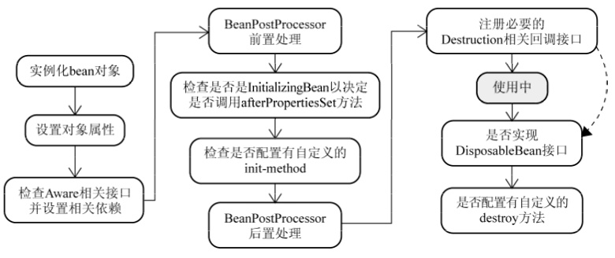
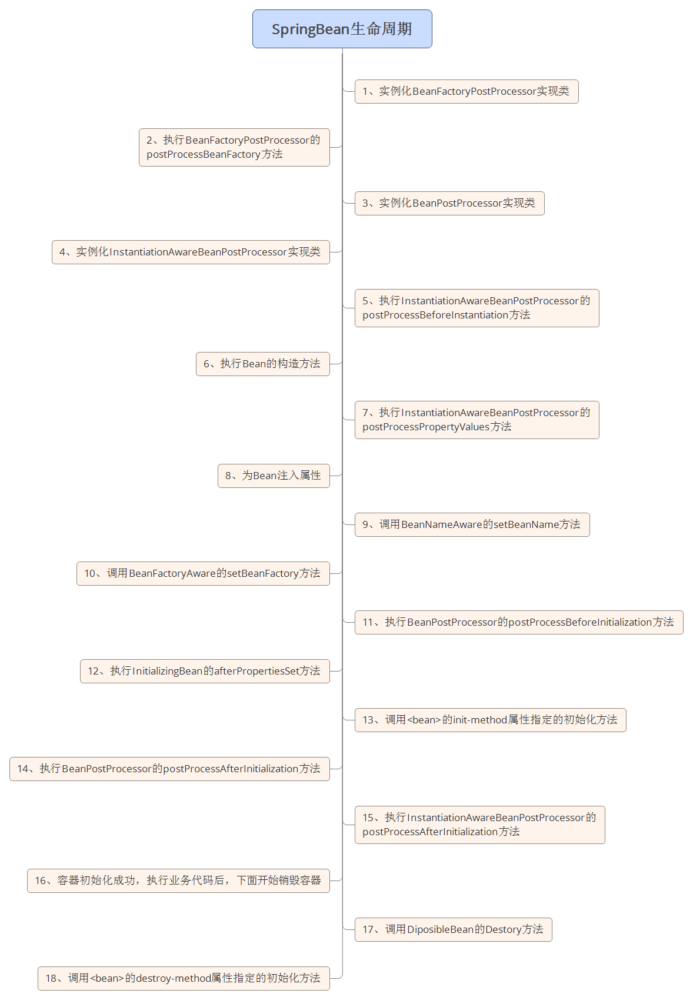

#首先你需要知道的知识

## 1.IOC容器的初始化过程

初始化的过程主要就是读取XML资源，并解析，最终注册到Bean Factory中：

在完成初始化的过程后，Bean们就在BeanFactory中蓄势以待地等调用了。

在IoC容器启动之后，并不会马上就实例化相应的bean，此时容器仅仅拥有所有对象的**BeanDefinition**(BeanDefinition：是容器依赖某些工具加载的XML配置信息进行解析和分析，并将分析后的信息编组为相应的BeanDefinition)。只有当**getBean()**调用时才是有可能触发Bean实例化阶段的活动

###为什么说有可能触发Bean实例化阶段？

> 因为当对应某个bean定义的getBean()方法第一次被调用时，不管是显示的还是隐式的，Bean实例化阶段才会被触发，第二次被调用则会直接返回容器缓存的第一次实例化完的对象实例(因为默认是singleton单例，当然，这里的情况prototype类型的bean除外)

##2. 注入依赖

当完成初始化IOC容器后，如果bean没有设置lazy-init(延迟加载)属性，那么bean的实例就会在初始化IOC完成之后，及时地进行初始化。初始化时会先建立实例，然后根据配置利用反射对实例进行进一步操作，具体流程如下所示：

# bean的生命周期

对于普通的Java对象，当new的时候创建对象，当它没有任何引用的时候被垃圾回收机制回收。而由Spring IoC容器托管的对象，它们的生命周期完全由容器控制。Spring中每个Bean的生命周期如下：

更详细的流程图：

## 1. 实例化Bean

**对于BeanFactory容器**，当客户向容器请求一个尚未初始化的bean时，或初始化bean的时候需要注入另一个尚未初始化的依赖时，容器就会调用createBean进行实例化。 
**对于ApplicationContext容器**，当容器启动结束后，便实例化所有的bean。 
容器通过获取BeanDefinition对象中的信息进行实例化。并且这一步仅仅是简单的实例化，并未进行依赖注入。 
实例化对象被包装在BeanWrapper对象中，BeanWrapper提供了设置对象属性的接口，从而避免了使用反射机制设置属性。

## 2. 设置对象属性（依赖注入）

实例化后的对象被封装在BeanWrapper对象中，并且此时对象仍然是一个原生的状态，并没有进行依赖注入。 
紧接着，Spring根据BeanDefinition中的信息进行依赖注入。 
并且通过BeanWrapper提供的设置属性的接口完成依赖注入。

## 3. 注入Aware接口

紧接着，Spring会检测该对象是否实现了xxxAware接口，并将相关的xxxAware实例注入给bean。

## 4. BeanPostProcessor

当经过上述几个步骤后，bean对象已经被正确构造，但如果你想要对象被使用前再进行一些自定义的处理，就可以通过BeanPostProcessor接口实现。 
该接口提供了两个函数：

- postProcessBeforeInitialzation( Object bean, String beanName ) 
  当前正在初始化的bean对象会被传递进来，我们就可以对这个bean作任何处理。 
  这个函数会先于InitialzationBean执行，因此称为前置处理。 
  所有Aware接口的注入就是在这一步完成的。
- postProcessAfterInitialzation( Object bean, String beanName ) 
  当前正在初始化的bean对象会被传递进来，我们就可以对这个bean作任何处理。 
  这个函数会在InitialzationBean完成后执行，因此称为后置处理。

## 5. InitializingBean与init-method

当BeanPostProcessor的前置处理完成后就会进入本阶段。 
InitializingBean接口只有一个函数：

- afterPropertiesSet()

这一阶段也可以在bean正式构造完成前增加我们自定义的逻辑，但它与前置处理不同，由于该函数并不会把当前bean对象传进来，因此在这一步没办法处理对象本身，只能增加一些额外的逻辑。 
若要使用它，我们需要让bean实现该接口，并把要增加的逻辑写在该函数中。然后Spring会在前置处理完成后检测当前bean是否实现了该接口，并执行afterPropertiesSet函数。

当然，Spring为了降低对客户代码的侵入性，给bean的配置提供了init-method属性，该属性指定了在这一阶段需要执行的函数名。Spring便会在初始化阶段执行我们设置的函数。init-method本质上仍然使用了InitializingBean接口。

## 6.bean使用中

## 7. DisposableBean和destroy-method

和init-method一样，通过给destroy-method指定函数，就可以在bean销毁前执行指定的逻辑。