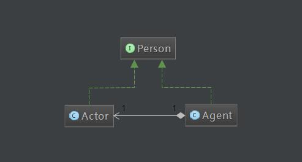
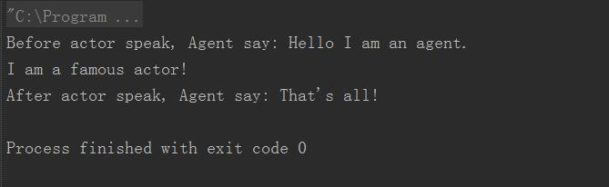
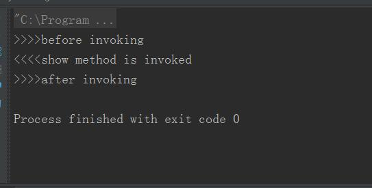
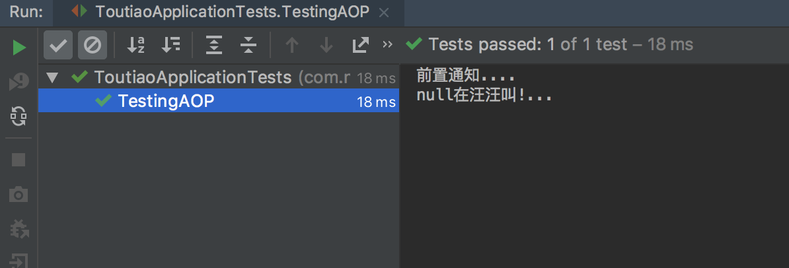
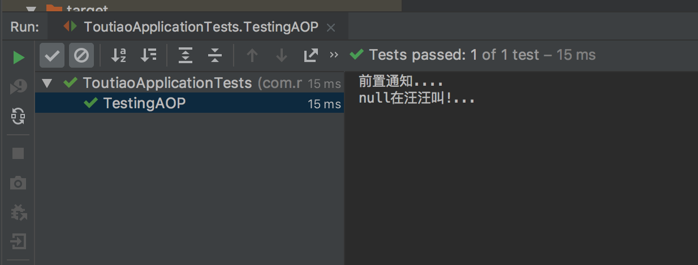

#Spring AOP实现原理

## AOP

AOP（==Aspect Orient Programming==），一般称为面向切面编程，作为面向对象的一种补充，用于处理系统中分布于各个模块的横切关注点，比如事务管理、日志、缓存等等。AOP实现的关键在于AOP框架自动创建的AOP代理，AOP代理主要分为**静态代理**和**动态代理**，==静态代理==的代表为**==AspectJ==**；而==动态代理==则以Spring AOP为代表，Spring AOP的两种代理实现机制，**JDK动态代理**和**CGLIB动态代理**。静态代理是编译期实现，动态代理是运行期实现，可想而知前者拥有更好的性能。

## 静态代理和动态代理

==**静态代理**==是**编译阶段生成AOP代理类，也就是说生成的字节码就织入了增强后的AOP对象**（其实就是设计模式中的代理模式）；**==动态代理==**则==不会修改字节码，而是在内存中临时生成一个AOP对象，这个AOP对象包含了目标对象的全部方法，并且在特定的切点做了增强处理，并回调原对象的方法==。

Spring AOP中的动态代理主要有两种方式，==JDK动态代理==和==CGLIB动态代理==。JDK动态代理通过反射来接收被代理的类，并且要求被代理的类必须实现一个接口。JDK动态代理的核心是**InvocationHandler接口**和**Proxy类**。

==如果目标类没有实现接口，那么Spring AOP会选择使用CGLIB来动态代理目标类==。CGLIB（Code Generation Library），是一个代码生成的类库，可以在运行时动态的生成某个类的子类，注意，CGLIB是通过继承的方式做的动态代理，因此如果某个类被标记为final，那么它是无法使用CGLIB做动态代理的，诸如private的方法也是不可以作为切面的。

## 代理模式

代理模式的UML类图如下：



可以看到还是很简单的，代理类实现了被代理类的接口，同时与被代理类是组合关系。下面看一下代理模式的实现。

## 静态代理

> 静态代理其实就是指设计模式中的代理模式。
> 代理模式为其他对象提供一种代理以控制对这个对象的访问。

接口类：

~~~java
interface Person {
    void speak();
}
~~~

实体类：

~~~java
class Actor implements Person {
    private String content;
    public Actor(String content) {
        this.content = content;
    }

    @Override
    public void speak() {
        System.out.println(this.content);
    }
}
~~~

代理类：

~~~java
class Agent implements Person {
    private Actor actor;
    private String before;
    private String after;
  // 内部一定要有一个真实的实现类，通过构造方法注入
    public Agent(Actor actor, String before, String after) {
        this.actor = actor;
        this.before = before;
        this.after = after;
    }
    @Override
    public void speak() {
        //before speak
        System.out.println("Before actor speak, Agent say: " + before);
        //real speak
        this.actor.speak();
        //after speak
        System.out.println("After actor speak, Agent say: " + after);
    }
}
~~~

测试方法：

~~~java
public class StaticProxy {
    public static void main(String[] args) {
        Actor actor = new Actor("I am a famous actor!");
        Agent agent = new Agent(actor, "Hello I am an agent.", "That's all!");
        agent.speak();
    }
}
~~~

结果：



## 动态代理

### JDK自带方法

首先介绍一下最核心的一个接口和一个方法：

首先是java.lang.reflect包里的==InvocationHandler==接口：

```java
public interface InvocationHandler {
    public Object invoke(Object proxy, Method method, Object[] args)
        throws Throwable;
}
```

我们对于被代理的类的操作都会由该接口中的invoke方法实现，其中的参数的含义分别是：

- proxy：被代理的类的实例
- method：调用被代理的类的方法
- args：该方法需要的参数

使用方法首先是需要实现该接口，并且我们可以在invoke方法中调用被代理类的方法并获得返回值，自然也可以在调用该方法的前后去做一些额外的事情，从而实现动态代理，下面的例子会详细写到。

另外一个很重要的静态方法是java.lang.reflect包中的==Proxy类的newProxyInstance==方法：

```java
public static Object newProxyInstance(ClassLoader loader,
                                      Class<?>[] interfaces,
                                      InvocationHandler h)
    throws IllegalArgumentException
```

其中的参数含义如下：

- loader：被代理的类的类加载器
- interfaces：被代理类的接口数组
- invocationHandler：就是刚刚介绍的调用处理器类的对象实例

该方法会返回一个被修改过的类的实例，从而可以自由的调用该实例的方法。下面是一个实际例子。

Fruit接口：

```java
public interface Fruit {
    public void show();
}
```

Apple实现Fruit接口：

```java
public class Apple implements Fruit{
    @Override
    public void show() {
        System.out.println("<<<<show method is invoked");
    }
}
```

代理类Agent.java：

```java
public class DynamicAgent {

    //实现InvocationHandler接口，并且可以初始化被代理类的对象
    static class MyHandler implements InvocationHandler {
        private Object proxy;
        public MyHandler(Object proxy) {
            this.proxy = proxy;
        }
            
        //自定义invoke方法
        @Override
        public Object invoke(Object proxy, Method method, Object[] args) throws Throwable {
            System.out.println(">>>>before invoking");
            //真正调用方法的地方
            Object ret = method.invoke(this.proxy, args);
            System.out.println(">>>>after invoking");
            return ret;
        }
    }

    //返回一个被修改过的对象
    public static Object agent(Class interfaceClazz, Object proxy) {
        return Proxy.newProxyInstance(interfaceClazz.getClassLoader(), new Class[]{interfaceClazz},new MyHandler(proxy));
    }    
}
```

测试类：

```java
public class ReflectTest {
    public static void main(String[] args) throws InvocationTargetException, IllegalAccessException {
        //注意一定要返回接口，不能返回实现类否则会报错
        Fruit fruit = (Fruit) DynamicAgent.agent(Fruit.class, new Apple());
        fruit.show();
    }
}
```

结果：


可以看到对于不同的实现类来说，可以用同一个动态代理类来进行代理，实现了==“一次编写到处代理==”的效果。但是这种方法有个缺点，**==就是被代理的类一定要是实现了某个接口的==**，这很大程度限制了本方法的使用场景。下面还有另外一个使用了CGlib增强库的方法。

###CGLIB库的方法

[CGlib](https://github.com/cglib/cglib)是一个字节码增强库，为AOP等提供了底层支持。下面看看它是怎么实现动态代理的。

~~~java
import net.sf.cglib.proxy.Enhancer;
import net.sf.cglib.proxy.MethodInterceptor;
import net.sf.cglib.proxy.MethodProxy;
import java.lang.reflect.Method;

public class CGlibAgent implements MethodInterceptor {

    private Object proxy;

    public Object getInstance(Object proxy) {
        this.proxy = proxy;
        Enhancer enhancer = new Enhancer();
        enhancer.setSuperclass(this.proxy.getClass());
        // 回调方法
        enhancer.setCallback(this);
        // 创建代理对象
        return enhancer.create();
    }
    //回调方法
    @Override
    public Object intercept(Object o, Method method, Object[] objects, MethodProxy methodProxy) throws Throwable {
        System.out.println(">>>>before invoking");
        //真正调用
        Object ret = methodProxy.invokeSuper(o, objects);
        System.out.println(">>>>after invoking");
        return ret;
    }
    //测试
    public static void main(String[] args) {
        CGlibAgent cGlibAgent = new CGlibAgent();
        Apple apple = (Apple) cGlibAgent.getInstance(new Apple());
        apple.show();
    }
}
~~~

结果：



可以看到结果和JDK动态代理是一样的，但是可以直接对实现类进行操作而非接口，这样会有很大的便利。

# AOP在Spring中的使用

AOP的概念：

- ==切点==:定位到具体方法的一个表达式
- ==切面==: 切点+建言
- ==建言==(增强):定位到方法后干什么事

##实际应用：

###实体类：

~~~java
public class Dog {

    private String name;


    public void say(){
        System.out.println(name + "在汪汪叫!...");
    }

    public String getName() {
        return name;
    }

    public void setName(String name) {
        this.name = name;
    }
}
~~~

###切面类:

~~~java
@Aspect //声明自己是一个切面类
public class MyAspect {
    /**
     * 前置通知
     */
     //@Before是增强中的方位
     // @Before括号中的就是切入点了
     //@Before下的方法就是传说的增强(建言):说白了，就是要干啥事.
    @Before("execution(* com.zdy..*(..))")
    public void before(){
        System.out.println("前置通知....");
    }
}
~~~

这个类是重点，先用**@Aspect**声明自己是切面类，然后before()为增强，**@Before(方位)+切入点**可以具体定位到具体某个类的某个方法的方位. 

###Spring配置文件:

~~~xml
    //开启AspectJ功能.
    <aop:aspectj-autoproxy />

    <bean id="dog" class="com.zdy.Dog" />
    <!-- 定义aspect类 -->
    <bean name="myAspect" class="com.zdy.MyAspect"/>
~~~

然后Main方法:

~~~java
        ApplicationContext ac =new ClassPathXmlApplicationContext("applicationContext.xml");
        Dog dog =(Dog) ac.getBean("dog");
        dog.say();
~~~

输出结果:

~~~
前置通知....
null在汪汪叫!...
~~~

说白了，就是把切面类丢到容器，开启一个AspectJ的功能，**Spring AOP就会根据切面类中的(@Before+切入点)定位好具体的类的某个方法(我这里定义的是com.zdy包下的所有类的所有方法)，然后把增强before()切入进去.**

##Spring AOP中常用AspectJ注解：

- **前置通知@Before**: 前置通知通过@Before注解进行标注，并可直接传入切点表达式的值，该通知在目标函数执行前执行，注意JoinPoint，是Spring提供的静态变量，通过joinPoint 参数，可以获取目标对象的信息,如类名称,方法参数,方法名称等，该参数是可选的。

```java
@Before("execution(...)")
public void before(JoinPoint joinPoint){
    System.out.println("...");
}
```

- **最终通知 @After**:该通知有点类似于finally代码块，只要应用了无论什么情况下都会执行.

```java
@After("execution(...)")
public void after(JoinPoint joinPoint) {
    System.out.println("最终通知....");
}
```

# AOP在Springboot中的使用

##1.定义切面类

~~~java
@Aspect
@Component
public class TestAspect {
  
    @Before("execution(* com.nowcoder.model.Dog..*(..))")
    public void before(){
        System.out.println("前置通知....");
  }
}
~~~

**==切点==**：@Before("execution(* com.nowcoder.model.Dog..*(..))")

**==建言(增强)==**：注解修饰的before()方法

**==切面==**：切点+建言(增强)，也就是**注解+方法**

**注意**用到了**@Component**注解，就是把这个类加载造IOC容器中。

## 2.实体类

~~~java
@Component
public class Dog {

    private String name;


    public void say(){
        System.out.println(name + "在汪汪叫!...");
    }

    public String getName() {
        return name;
    }

    public void setName(String name) {
        this.name = name;
    }

}

~~~

可以看到，必须加@Component注解

##3.测试

~~~java
package com.nowcoder;

import com.nowcoder.model.Dog;
import org.junit.Test;
import org.junit.runner.RunWith;
import org.springframework.beans.factory.annotation.Autowired;
import org.springframework.boot.test.SpringApplicationConfiguration;
import org.springframework.context.ApplicationContext;
import org.springframework.test.context.junit4.SpringJUnit4ClassRunner;
import org.springframework.test.context.web.WebAppConfiguration;

@RunWith(SpringJUnit4ClassRunner.class)
@SpringApplicationConfiguration(classes = ToutiaoApplication.class)
@WebAppConfiguration
public class ToutiaoApplicationTests {
	@Autowired
  ApplicationContext applicationContext;

	@Test
	public void TestingAOP(){

		Dog dog=(Dog) applicationContext.getBean(Dog.class);
		dog.say();
    
	}
}
~~~

输出结果：



## 补充：

其实就这个例子而言，把Dog类加入到IOC容器中还有一种方法

第一种方法将Dog类加上了@Component注解，使其加入到IOC容器中。

第二种方法是定义另外一个配置类，用@Configuration注解。

### 实体类

~~~java
public class Dog {

    private String name;


    public void say(){
        System.out.println(name + "在汪汪叫!...");
    }

    public String getName() {
        return name;
    }

    public void setName(String name) {
        this.name = name;
    }

}
~~~

没有@Component注解

### 配置类

~~~java
package com.nowcoder.config;

import com.nowcoder.model.Dog;
import org.springframework.context.annotation.Bean;
import org.springframework.context.annotation.Configuration;

@Configuration
public class AOPconfig {
    @Bean
    public Dog dog(){
        return new Dog();
    }

}
~~~

使用@Configuration修饰配置类，@Bean修饰返回实体类的方法。

结果：



其实两种方法的不同地方在于怎么将实体类加载到IOC容器中，一种使用@Component修饰实体类，另一种是使用@Configuration修饰配置类。