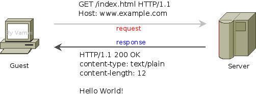
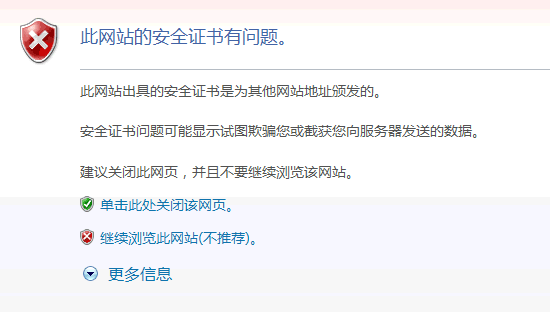

#前言：

TCP协议实现了==数据流==的可靠传输。然而，人们更加习惯以文件为单位传输资源，比如文本文件，图像文件，超文本文档(hypertext document)。

==超文本文档==中包含有超链接，指向其他的资源。超文本文档是万维网(World Wide Web，即www)的基础。

HTTP协议==解决文件传输==的问题。HTTP是应用层协议，==主要建立在TCP协议之上==(偶尔也可以UDP为底层)。它随着万维网的发展而流行。HTTP协议目的是，如何在万维网的网络环境下，更好的利用TCP协议，以实现文件，特别是超文本文件的传输。

早期的HTTP协议主要传输静态文件，即真实存储在服务器上的文件。随着万维网的发展，HTTP协议被用于传输“动态文件”，服务器上的程序根据HTTP请求即时生成的动态文件。我们将HTTP的传输对象统称为==资源==(resource)。

**点单**

HTTP实现了资源的订购和传送。其工作方式类似于快餐点单。

1：==请求==(request): 顾客向服务员提出请求：“来个鸡腿汉堡”。

2：==回复==(response):服务员根据情况，回应顾客的请求

根据情况的不同，服务员的回应可能有很多，比如:

服务员准备鸡腿汉堡，将鸡腿汉堡交给顾客。（一切OK）

服务员发现自己只是个甜品站。他让顾客前往正式柜台点单。（重新定向）

服务员告诉顾客鸡腿汉堡没有了。(无法找到)

交易结束后，服务员就将刚才的交易抛到脑后，准备服务下一位顾客。

# HTTP具体实现

## **格式**

HTTP协议的通信是一次==request-responce==交流。客户端(guest)向服务器发出请求(request)，服务器(server)回复(response)客户端。



HTTP协议规定了请求和回复的格式:

```
起始行 (start line)
头信息 (headers)

主体(entity body)
```

==起始行==只有一行。它包含了请求/回复最重要的信息。请求的起始行表示(顾客)“想要什么”。回复的起始行表示(后厨)“发生什么”。

==头信息==可以有多行。每一行是一对键值对(key-value pair)，比如:

```
Content-type: text/plain 
```

它表示，包含有一个名为Content-type的参数，该参数的值为text/plain。头信息是对起始行的补充。请求的头信息对服务器有指导意义 (好像在菜单上注明: 鸡腿不要辣)。回复的头信息则是提示客户端（比如，在盒子上注明: 小心烫）

==主体部分==包含了具体的资源。上图的请求中并没有主体，因为我们只是在下单，而不用管后厨送什么东西 (请求是可以有主体内容的)。回复中包含的主体是一段文本文字(Hello World!)。这段文本文字正是顾客所期待的，鸡腿汉堡。

##请求（Request）

我们深入一些细节。先来看一下请求的第一行:

```
GET /index.html HTTP/1.1
Host: www.example.com
```

在起始行中，有三段信息:

==GET== ：用于说明想要服务器执行的操作，此外还有**PUT、POST等操作**

==/index.html== ：资源的路径。这里指向服务器上的index.html文件。

==HTTP/1.1==： 协议的版本。HTTP第一个广泛使用的版本是1.0，当前版本为1.1。

早期的HTTP协议只有GET方法。遵从HTTP协议，服务器接收到GET请求后，会将特定资源传送给客户。这类似于客户点单，并获得汉堡的过程。使用GET方法时，是客户向服务器索取资源，所以请求往往没有主体部分。

GET方法也可以用于传输一些不重要的数据。它是通过改写URL的方式实现的。GET的数据利用==URL?变量名＝变量值==的方法传输。比如向http://127.0.0.1发送一个变量“q”，它的值为“a”。那么，实际的URL为http://127.0.0.1?q=a。服务器收到请求后，就可以知道"q"的值为"a"。

GET方法之外，最常用的是POST方法。它用于从客户端向服务器提交数据。使用POST方法时，URL不再被改写。数据位于http请求的主体。POST方法最用于提交HTML的form数据。服务器往往会对POST方法提交的数据进行一定的处理，比如存入服务器数据库。

样例请求中有一行头信息。该头信息的名字是Host。HTTP的请求必须有Host头信息，用于说明服务器的地址和端口。HTTP协议的默认端口是80，如果在HOST中没有说明端口，那么将默认采取该端口。在该例子中，服务器的域名为www.example.com，端口为80。域名将通过DNS服务器转换为IP地址，从而确定服务器在互联网上的地址。

牛客项目中**Request Headers**：


##回复(Response)

服务器在接收到请求之后，会根据程序，生成对应于该请求的回复，比如:

```
HTTP/1.1 200 OK
Content-type: text/plain
Content-length: 12

Hello World!
```

回复的起始行同样包含三段信息

```
HTTP/1.1 协议版本
200 状态码(status code)
OK 状态描述
```

OK是对状态码200的文字描述，它只是为了便于人类的阅读。电脑只关心三位的状态码(status code)，即这里的200。200表示一切OK，资源正常返回。状态码代表了服务器回应动作的类型。

其它常见的状态码还有:

302，重定向(redirect): 我这里没有你想要的资源，但我知道另一个地方xxx有，你可以去那里找。

404，无法找到(not found): 我找不到你想要的资源，无能为力。

Content-type说明了主体所包含的资源的类型。根据类型的不同，客户端可以启动不同的处理程序(比如显示图像文件，播放声音文件等等)。下面是一些常见的资源：

```
text/plain 普通文本
text/html HTML文本
image/jpeg jpeg图片
image/gif gif图片
```

Content-length说明了主体部分的长度，以字节(byte)为单位。

回应的主体部分为一段普通文本，即Hello World!

牛客项目中**Response Headers**


##常见的请求和相应头

#### 请求(客户端->服务端[**request**])

> GET(请求的方式) /newcoder/hello.html(请求的目标资源) HTTP/1.1(请求采用的协议和版本号)
> Accept: */*(客户端能接收的资源类型)
> Accept-Language: en-us(客户端接收的语言类型)
> Connection: Keep-Alive(维护客户端和服务端的连接关系)
> Host: localhost:8080(连接的目标主机和端口号)
> Referer: [http://localhost/links.jsp(](https://link.jianshu.com/?t=http%3A%2F%2Flocalhost%2Flinks.jsp%28)告诉服务器我来自于哪里)
> User-Agent: Mozilla/4.0(客户端版本号的名字)
> Accept-Encoding: gzip, deflate(客户端能接收的压缩数据的类型)
> If-Modified-Since: Tue, 11 Jul 2017 18:23:51 GMT(缓存时间)
> Cookie(客户端暂存服务端的信息)
> Date: Tue, 18 Jul 12:15:02 GMT(客户端请求服务端的时间)

#### 响应(服务端->客户端[**response**])

> HTTP/1.1(响应采用的协议和版本号) 200(状态码) OK(描述信息)
> Location: [http://www.baidu.com(](https://link.jianshu.com/?t=http%3A%2F%2Fwww.baidu.com%28)服务端需要客户端访问的页面路径)
> Server:apache tomcat(服务端的Web服务端名)
> Content-Encoding: gzip(服务端能够发送压缩编码类型)
> Content-Length: 80(服务端发送的压缩数据的长度)
> Content-Language: zh-cn(服务端发送的语言类型)
> Content-Type: text/html; charset=GB2312(服务端发送的类型及采用的编码方式)
> Last-Modified: Tue, 18 Jul 2017 12:15:02 GMT(服务端对该资源最后修改的时间)
> Refresh: 1;url=[http://www.helloyoucan.com.(](https://link.jianshu.com/?t=http%3A%2F%2Fwww.helloyoucan.com.%28)服务端要求客户端1秒钟后，刷新，然后访问指定的页面路径)
> Content-Disposition: attachment; filename=aaa.zip(服务端要求客户端以下载文件的方式打开该文件)
> Transfer-Encoding: chunked(分块传递数据到客户端）
> Set-Cookie:SS=Q0=5Lb_nQ; path=/search(服务端发送到客户端的暂存数据)
> Expires: -1//3种(服务端禁止客户端缓存页面数据)
> Cache-Control: no-cache(服务端禁止客户端缓存页面数据)
> Pragma: no-cache(服务端禁止客户端缓存页面数据)
> Connection: close(1.0)/(1.1)Keep-Alive(维护客户端和服务端的连接关系)
> Date: Tue, 18 Jul 2017 12:18:03 GMT(服务端响应客户端的时间)

##无状态

根据早期的HTTP协议，每次request-reponse时，都要重新建立TCP连接。TCP连接每次都重新建立，所以服务器无法知道上次请求和本次请求是否来自于同一个客户端。因此，HTTP通信是无状态(stateless)的。服务器认为每次请求都是一个全新的请求，无论该请求是否来自同一地址。

想象高级餐厅和快餐店。高级餐厅会知道客人所在的位置，如果新增点单，那么服务员知道这和上一单同一桌。而在快餐店中，不好意思，服务员并不记录客人的特征。想再次点单？请重新排队……

随着HTTP协议的发展，HTTP协议允许TCP连接复用，以节省建立连接所耗费的时间。但HTTP协议依然保持无状态的特性。

#两种 HTTP 方法：GET 和 POST

|                  | **GET**                                                      | **POST**                                                     |
| ---------------- | :----------------------------------------------------------- | ------------------------------------------------------------ |
| 后退按钮/刷新    | 无害                                                         | 数据会被重新提交（浏览器应该告知用户数据会被重新提交）。     |
| 书签             | 可收藏为书签                                                 | 不可收藏为书签                                               |
| 缓存             | 能被缓存                                                     | 不能缓存                                                     |
| 编码类型         | application/x-www-form-urlencoded                            | application/x-www-form-urlencoded 或   multipart/form-data。为二进制数据使用多重编码。 |
| 历史             | 参数保留在浏览器历史中。                                     | 参数不会保存在浏览器历史中。                                 |
| 对数据长度的限制 | 是的。当发送数据时，GET 方法向 URL 添加数据；URL 的长度是受限制的（URL 的最大长度是 2048 个字符）。 | 无限制。                                                     |
| 对数据类型的限制 | 只允许 ASCII 字符。                                          | 没有限制。也允许二进制数据。                                 |
| 安全性           | 与 POST 相比，GET 的安全性较差，因为所发送的数据是 URL 的一部分。   在发送密码或其他敏感信息时绝不要使用 GET ！ | POST 比 GET 更安全，因为参数不会被保存在浏览器历史或 web 服务器日志中。 |
| 可见性           | 数据在 URL 中对所有人都是可见的。                            | 数据不会显示在 URL 中。                                      |

# HTTPS

###什么是HTTPS?

HTTPS 协议是由 SSL+HTTP 协议构建的可进行加密传输、身份认证的 网络协议，要比 http 协议安全。  

###**https** 与 **http** 区别 ?

1)https 协议需要到 ca 申请证书，一般免费证书较少，因而需要一定费用。 

2)http 是超文本传输协议，==信息是明文传输==，https 则是具有安全性的 ssl 加密传输协议。 

3)http 和 https 使用的是完全不同的连接方式，用的端口也不一样，前者是 ==80==，后者是 ==443==。 

4)http 的连接很简单，==是无状态的==;HTTPS 协议是由 SSL+HTTP 协议构建的可进行加密传输、身份认证的网络协议，比 http 协议安全。


文字简述:客户端 A 和服务器 B 之间的交互 

1. A与B通过TCP建立链接，初始化SSL层。 
2. 进行 SSL 握手，A 发送 https 请求，传送客户端 SSL 协议版本号、支持的加密算法、 随机数等。 
3. 服务器 B 把 CA 证书(包含 B 的公钥)，把自己支持的加密算法、随机数等回传给 A。 
4. A 接收到 CA 证书，验证证书有效性。 
5. 校验通过，客户端随机产生一个字符串作为与 B 通信的对称密钥，通过 CA 证书解出服务器 B 的公钥，对其加密，发送给服务器。

6. B 用私钥解开信息，得到随机的字符串(对称密钥)，利用这个密钥作为之后的通信密钥。 
7. 客户端向服务器发出信息，指明后面的数据使用该对称密钥进行加密，同时通知服 务器 SSL 握手结束。 
8. 服务器接收到信息，使用对称密钥通信，通知握手接收。 
9. SSL 握手结束，使用对称密钥加密数据。 

###安全加密

1.


鲍勃有两把钥匙，一把是公钥，另一把是私钥。

2.


鲍勃把公钥送给他的朋友们----帕蒂、道格、苏珊----每人一把。

3.


苏珊要给鲍勃写一封保密的信。她写完后用鲍勃的公钥加密，就可以达到保密的效果。

4.


鲍勃收信后，用私钥解密，就看到了信件内容。这里要强调的是，只要鲍勃的私钥不泄露，这封信就是安全的，即使落在别人手里，也无法解密。

5.


鲍勃给苏珊回信，决定采用"数字签名"。他写完后先用Hash函数，生成信件的摘要（digest）。

> 这里主要解释一下签名，签名就是在信息的后面再加上一段内容，==可以证明信息没有被修改过==，怎么样可以达到这个效果呢？一般是对信息做一个hash计算得到一个hash值，注意，这个过程是不可逆的，也就是说无法通过hash值得出原来的信息内容。在把信息发送出去时，把这个hash值加密后做为一个签名和信息一起发出去。
> 接收方在收到信息后，会重新计算信息的hash值，并和信息所附带的hash值(解密后)进行对比，如果一致，就说明信息的内容没有被修改过，因为这里hash计算可以保证不同的内容一定会得到不同的hash值，所以只要内容一被修改，根据信息内容计算的hash值就会变化。当然，不怀好意的人也可以修改信息内容的同时也修改hash值，从而让它们可以相匹配，为了防止这种情况，hash值一般都会加密后(也就是签名)再和信息一起发送，以保证这个hash值不被修改。

**补充知识点**：

那么问题来了，==是将发送的全部内容hash嘛==？

这里用到的hash算法其实就是==将一段非常长的数据通过hash变换为一个固定长度相对较短的数据==，简称“**摘要**”，你可以理解成把一本书通过hash变成一段很短的话，算法最关键的要点是，哪怕你改动了这本书里面的一个标点符号，hash后的摘要都会改变。

以MD5这种hash算法为例，他可以将任意长度的数据变成128位的散列值，所谓任意长度的意思就是你的数据可以是一篇文章，一部电影，或者只是一个字母，哪怕是个空字符串。

6.


然后，鲍勃使用私钥，对这个摘要加密，生成"==数字签名=="（signature）。

7.


鲍勃将这个签名，附在信件下面，一起发给苏珊。

8.


苏珊收信后，取下数字签名，用鲍勃的公钥解密，得到信件的摘要。由此证明，这封信确实是鲍勃发出的。

9.


苏珊再对信件本身使用Hash函数，将得到的结果，与上一步得到的摘要进行对比。如果两者一致，就证明这封信未被修改过。

10.


复杂的情况出现了。道格想欺骗苏珊，他偷偷使用了苏珊的电脑，用自己的公钥换走了鲍勃的公钥。此时，苏珊实际拥有的是道格的公钥，但是还以为这是鲍勃的公钥。因此，道格就可以冒充鲍勃，用自己的私钥做成"数字签名"，写信给苏珊，让苏珊用假的鲍勃公钥进行解密。

11.


后来，苏珊感觉不对劲，发现自己无法确定公钥是否真的属于鲍勃。她想到了一个办法，要求鲍勃去找"证书中心"（certificate authority，简称CA），为公钥做认证。证书中心用自己的私钥，对鲍勃的公钥和一些相关信息一起加密，生成"数字证书"（Digital Certificate）。

**知识点补充**：

> 介绍下数字证书：
>
> 数字证书则是由证书认证机构(CA, Certificate Authority)对证书申请者真实身份验证之后，用CA的根证书对申请人的一些基本信息以及申请人的公钥进行签名(相当于加盖发证书机构的公章)后形成的一个数字文件。
>
> **数字证书验证过程**:CA 机构的公钥已经是==在浏览器发布前提前嵌入到浏览器内部了==， 所以 CA 的公钥是真实可靠的(如果 CA 机构被黑客攻陷，那么也可能是不可靠的)，然后服务器发送自己的公钥给 CA(用 CA 的公钥进行加密)，CA 对服务器的发来的内容解密得到服务器的公钥，然后 CA 对服务器的公钥进行颁发数字证书(就是数字签名)，发给服务器，服务器收到以后，将==数字证书，公开密钥发送给客户端==，客户端用 CA 的公开密钥验证得到服务器的公开密钥，然后这样客户端就得到了真正可靠的服务器的公开密钥。 

12.


鲍勃拿到数字证书以后，就可以放心了。以后再给苏珊写信，只要在签名的同时，再附上数字证书就行了。

13.


苏珊收信后，用CA的公钥解开数字证书，就可以拿到鲍勃真实的公钥了，然后就能证明"数字签名"是否真的是鲍勃签的。

##HTTPS的实际应用

下面，我们看一个应用"数字证书"的实例：https协议。这个协议主要用于网页加密。


1.首先，客户端向服务器发出加密请求。


2.服务器用自己的私钥加密网页以后，连同本身的数字证书，一起发送给客户端。


3.客户端（浏览器）的"==证书管理器=="，有"受信任的根证书颁发机构"列表。客户端会根据这张列表，查看解开数字证书的公钥是否在列表之内。


4.如果数字证书记载的网址，与你正在浏览的网址不一致，就说明这张证书可能被冒用，浏览器会发出警告。



5.如果这张数字证书不是由受信任的机构颁发的，浏览器会发出另一种警告。


6.如果数字证书是可靠的，==客户端就可以使用证书中的服务器公钥==，对信息进行加密，然后与服务器交换加密信息。


##总结：

HTTPS为了兼顾安全与效率，同时使用了==对称加密==和==非对称加密==。数据是被对称加密传输的，对称加密过程需要客户端的一个密钥，为了确保能把该密钥安全传输到服务器端，采用非对称加密对该密钥进行加密传输，总的来说，==对数据进行对称加密，对称加密所要使用的密钥通过非对称加密传输==。

也就是说客户端使用对称加密加密数据，服务端通过非对称加密得到对称加密的秘钥。

为什么用对称秘钥加密数据呢？

可能是为了传输效率。因为私钥只有服务端自己有，足够安全，再加上对称加密的效率更高

**知识点补充：**

**对称加密**：对称加密又叫做私钥加密，即信息的发送方和接收方使用同一个密钥去加密和解密数据。对称加密的特点是算法公开、加密和解密速度快，适合于对大数据量进行加密，常见的对称加密算法有DES、3DES、TDEA、Blowfish、RC5和IDEA。
其加密过程如下：明文 + 加密算法 + 私钥 => 密文
解密过程如下：密文 + 解密算法 + 私钥 => 明文
对称加密中用到的密钥叫做私钥，私钥表示个人私有的密钥，即该密钥不能被泄露。
其加密过程中的私钥与解密过程中用到的私钥是同一个密钥，这也是称加密之所以称之为“对称”的原因。由于对称加密的算法是公开的，所以一旦私钥被泄露，那么密文就很容易被破解，所以对称加密的缺点是密钥安全管理困难。

**非对称加密**：非对称加密也叫做公钥加密。非对称加密与对称加密相比，其安全性更好。对称加密的通信双方使用相同的密钥，如果一方的密钥遭泄露，那么整个通信就会被破解。而非对称加密使用一对密钥，即公钥和私钥，且二者成对出现。私钥被自己保存，不能对外泄露。公钥指的是公共的密钥，任何人都可以获得该密钥。用公钥或私钥中的任何一个进行加密，用另一个进行解密。
被公钥加密过的密文只能被私钥解密，过程如下：
明文 + 加密算法 + 公钥 => 密文， 密文 + 解密算法 + 私钥 => 明文
被私钥加密过的密文只能被公钥解密，过程如下：
明文 + 加密算法 + 私钥 => 密文， 密文 + 解密算法 + 公钥 => 明文
由于加密和解密使用了两个不同的密钥，这就是非对称加密“非对称”的原因。
==非对称加密的缺点是加密和解密花费时间长、速度慢，只适合对少量数据进行加密。==
在非对称加密中使用的主要算法有：RSA、Elgamal、Rabin、D-H、ECC（椭圆曲线加密算法）等。