# TCP三次握手四次挥手

三次握手需要的信息:

==ACK== : TCP 协议规定，只有 ACK=1 时有效，也规定连接建立后所有发送的报文的 ACK 必须为 1。 

==SYN==(SYNchronization) : 在连接建立时用来同步序号。当 SYN=1 而 ACK=0 时，表明这是一个连接请求报文。对方若同意建立连接，则应在响应报文中使 SYN=1 和 ACK=1. 因此, SYN 置 1 就表示这是一个连接请求或连接接受报文。 

==FIN== (finish)即完，终结的意思， 用来释放一个连接。当 FIN = 1 时，表明此报文段 的发送方的数据已经发送完毕，并要求释放连接 。

==seq==(序号):

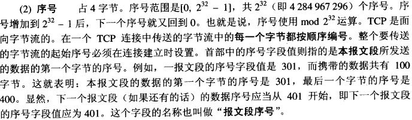

三次握手：

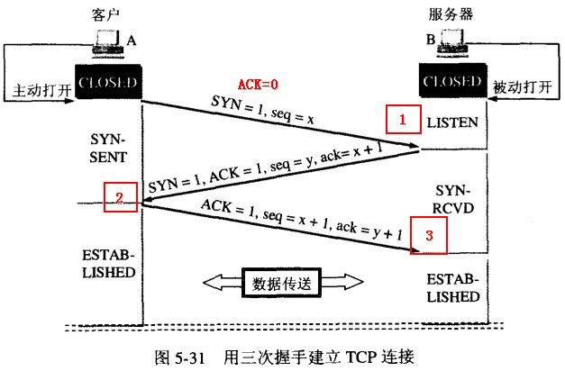

1. 首先由Client发出请求连接即 SYN=1，ACK=0， TCP规定SYN=1时不能携带数据，但要消耗一个序号,因此声明自己的序号是 seq=x；
2. 然后 Server 进行回复确认，即 SYN=1 ACK=1 seq=y, ack=x+1；
3. 再然后 Client 再进行一次确认，但不用SYN 了，这时即为 ACK=1, seq=x+1, ack=y+1.然后连接建立。

四次挥手：

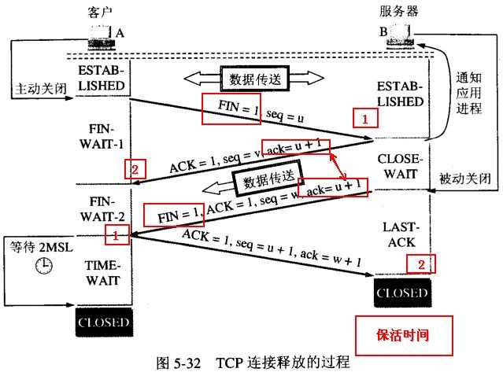

【注意】中断连接端可以是Client端，也可以是Server端。

假设Client端发起中断连接请求，也就是发送FIN报文。Server端接到FIN报文后，意思是说"我Client端没有数据要发给你了"，但是如果你还有数据没有发送完成，则不必急着关闭Socket，可以继续发送数据。所以你先发送ACK，"告诉Client端，你的请求我收到了，但是我还没准备好，请继续你等我的消息"。这个时候Client端就进入FIN_WAIT状态，继续等待Server端的FIN报文。当Server端确定数据已发送完成，则向Client端发送FIN报文，"告诉Client端，好了，我这边数据发完了，准备好关闭连接了"。Client端收到FIN报文后，"就知道可以关闭连接了，但是他还是不相信网络，怕Server端不知道要关闭，所以发送ACK后进入TIME_WAIT状态，如果Server端没有收到ACK则可以重传。“，Server端收到ACK后，"就知道可以断开连接了"。Client端等待了==2MSL==（*Maximum Segment Lifetime*，中文可以译为“==报文最大生存时间==”）后依然没有收到回复，则证明Server端已正常关闭，那好，我Client端也可以关闭连接了。Ok，TCP连接就这样关闭了！

整个过程Client端所经历的状态如下：

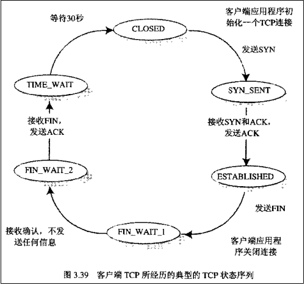

而Server端所经历的过程如下：

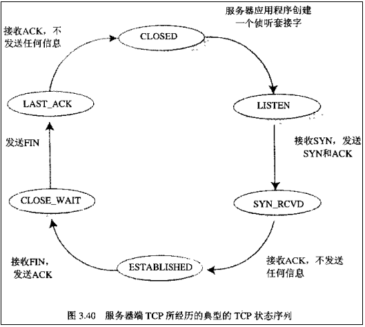

## 问题：

### 1.为什么要进行三次握手呢（两次确认）？

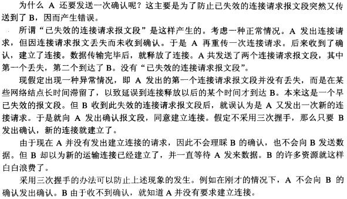

### 2.为什么连接的时候是三次握手，关闭的时候却是四次握手？

答：因为当Server端收到Client端的SYN连接请求报文后，可以直接发送SYN+ACK报文。其中ACK报文是用来应答的，SYN报文是用来同步的。但是关闭连接时，当Server端收到FIN报文时，很可能并不会立即关闭SOCKET，所以只能先回复一个ACK报文，告诉Client端，"你发的FIN报文我收到了"。只有等到我Server端所有的报文都发送完了，我才能发送FIN报文，因此不能一起发送。故需要四步握手。

### 3.为什么TIME_WAIT状态需要经过2MSL(最大报文段生存时间)才能返回到CLOSE状态？

答：虽然按道理，四个报文都发送完毕，我们可以直接进入CLOSE状态了，但是我们必须假象网络是不可靠的，有可能最后一个ACK丢失。所以TIME_WAIT状态就是用来重发可能丢失的ACK报文。

# TCP如何保证可靠性传输

**确保传输可靠性的方式：**

TCP协议保证数据传输可靠性的方式主要有：

1. 连接管理
2. 序列号
3. 确认应答
4. 超时重传
5. 流量控制
6. 拥塞控制
7. 校验和

## 1.连接管理

连接管理就是三次握手与四次挥手的过程，在前面详细讲过这个过程，这里不再赘述。保证可靠的连接，是保证可靠性的前提。

## 2&3. **确认应答与序列号**

**序列号**：TCP传输时将每个字节的数据都进行了编号，这就是序列号。 

**确认应答**：TCP传输的过程中，每次接收方收到数据后，都会对传输方进行确认应答。也就是发送ACK报文。这个ACK报文当中带有对应的确认序列号，告诉发送方，==接收到了哪些数据，下一次的数据从哪里发==。

## 4. 超时重传

在进行TCP传输时，由于确认应答与序列号机制，也就是说发送方发送一部分数据后，都会等待接收方发送的ACK报文，并解析ACK报文，判断数据是否传输成功。如果发送方发送完数据后，迟迟没有等到接收方的ACK报文，这该怎么办呢？而没有收到ACK报文的原因可能是什么呢？

首先，发送方没有介绍到响应的ACK报文原因可能有两点：

1.数据在传输过程中由于网络原因等直接全体丢包，接收方根本没有接收到。

2.接收方接收到了响应的数据，但是发送的ACK报文响应却由于网络原因丢包了。

 

TCP在解决这个问题的时候引入了一个新的机制，叫做==超时重传机制==。**简单理解就是发送方在发送完数据后等待一个时间，时间到达没有接收到ACK报文，那么对刚才发送的数据进行重新发送**。如果是刚才第一个原因，接收方收到二次重发的数据后，便进行ACK应答。如果是第二个原因，接收方发现接收的数据已存在（判断存在的根据就是序列号，所以上面说序列号还有去除重复数据的作用），那么直接丢弃，仍旧发送ACK应答。

### 补充知识点： 

==那么发送方发送完毕后等待的时间是多少呢？==如果这个等待的时间过长，那么会影响TCP传输的整体效率，如果等待时间过短，又会导致频繁的发送重复的包。如何权衡？

由于TCP传输时保证能够在任何环境下都有一个高性能的通信，因此这个最大超时时间（也就是等待的时间）是动态计算的。

   在Linux中（BSD Unix和Windows下也是这样）超时以500ms为一个单位进行控制，每次判定超时重发的超时时间都是500ms的整数倍。重发一次后，仍未响应，那么等待2*500ms的时间后，再次重传。等待4*500ms的时间继续重传。以一个指数的形式增长。累计到一定的重传次数，TCP就认为网络或者对端出现异常，强制关闭连接。   

## 5.  **流量控制**

接收端在接收到数据后，对其进行处理。如果发送端的发送速度太快，导致接收端的结束缓冲区很快的填充满了。此时如果发送端仍旧发送数据，那么接下来发送的数据都会丢包，继而导致丢包的一系列连锁反应，超时重传呀什么的。而==TCP根据接收端对数据的处理能力，决定发送端的发送速度，这个机制就是流量控制==。

 

在TCP协议的报头信息当中，有一个**16位字段的窗口大小**。在介绍这个窗口大小时我们知道，窗口大小的内容实际上是接收端接收数据缓冲区的剩余大小。这个数字越大，证明接收端接收缓冲区的剩余空间越大，网络的吞吐量越大。接收端会在确认应答发送ACK报文时，将自己的即时窗口大小填入，并跟随ACK报文一起发送过去。而发送方根据ACK报文里的窗口大小的值的改变进而改变自己的发送速度。如果接收到窗口大小的值为0，那么发送方将停止发送数据。并定期的向接收端发送窗口探测数据段，让接收端把窗口大小告诉发送端。

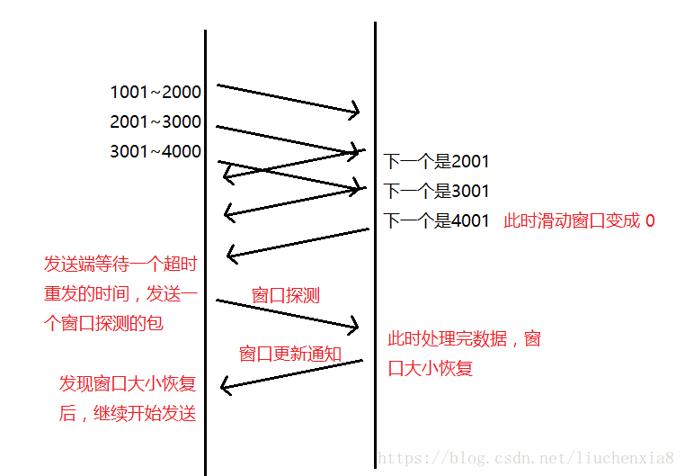

**注**：16位的窗口大小最大能表示65535个字节（64K），但是TCP的窗口大小最大并不是64K。在TCP首部中40个字节的选项中还包含了一个窗口扩大因子M，实际的窗口大小就是16为窗口字段的值左移M位。每移一位，扩大两倍。

### 滑动窗口协议（连续ARQ协议）

**连续ARQ协议**

在ARQ协议发送者每次只能发送一个分组，在应答到来前必须等待。而连续ARQ协议的发送者拥有一个发送窗口，发送者可以在没有得到应答的情况下连续发送窗口中的分组。这样降低了等待时间，提高了传输效率。 

**累计确认**

在连续ARQ协议中，接收者也有个接收窗口，接收者并不需要每收到一个分组就返回一个应答，可以连续收到分组之后统一返回一个应答。这样能节省流量。TCP头部的ack字段就是用来累计确认，它表示已经确认的字节序号+1，也表示期望发送者发送的下一个分组的起始字节号。

==发送窗口==

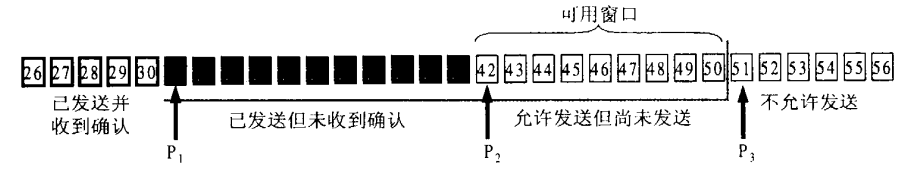

发送窗口的大小由接收窗口的剩余大小决定。接收者会把当前接收窗口的剩余大小写入应答TCP报文段的头部，发送者收到应答后根据该值和当前网络拥塞情况设置发送窗口的大小。发送窗口的大小是不断变化的。发送窗口由三个指针构成：

发送者每收到一个应答，后沿就可以向前移动指定的字节。此时若窗口大小仍然没变，前沿也可以向前移动指定字节。当p2和前沿重合时，发送者必须等待确认应答。

**p1**

p1指向发送窗口的后沿，它后面的字节表示已经发送且已收到应答。 

**p2**

p2指向尚未发送的第一个字节。p1-p2间的字节表示已经发送，但还没收到确认应答。这部分的字节仍需保留，因为可能还要超时重发。p2-p3间的字节表示可以发送，但还没有发送的字节。

**p3**

p3指向发送窗口的前沿，它前面的字节尚未发送，且不允许发送。

==接收窗口==

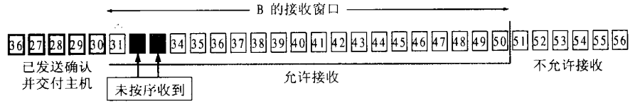

接收者收到的字节会存入接收窗口，接收者会对已经正确接收的有序字节进行累计确认，发送完确认应答后，接收窗口就可以向前移动指定字节。
 如果某些字节并未按序收到，接收者只会确认最后一个有序的字节，从而乱序的字节就会被重新发送。

**连续ARQ的注意点**

同一时刻发送窗口的大小并不一定和接收窗口一样大。虽然发送窗口的大小是根据接收窗口的大小来设定的，但应答在网络中传输是有时间的，有可能t1时间接收窗口大小为m，但当确认应答抵达发送者时，接收窗口的大小已经发生了变化。此外发送窗口的大小还随网络拥塞情况影响。当网络出现拥塞时，发送窗口将被调小。

TCP标准并未规定未按序到达的字节的处理方式。但TCP一般都会缓存这些字节，等缺少的字节到达后再交给应用层处理。这比直接丢弃乱序的字节要节约带宽。 

TCP标准规定接收方必须要有累计确认功能。接收方可以对多个TCP报文段同时确认，但不能拖太长时间，一般是0.5S以内。此外，TCP允许接收者在有数据要发送的时候捎带上确认应答。但这种情况一般较少，因为一般很少有两个方向都要发送数据的情况。

## 6. 拥塞控制

TCP传输的过程中，发送端开始发送数据的时候，如果刚开始就发送大量的数据，那么就可能造成一些问题。网络可能在开始的时候就很拥堵，如果给网络中在扔出大量数据，那么这个拥堵就会加剧。拥堵的加剧就会产生大量的丢包，就对大量的超时重传，严重影响传输。

所以TCP引入了==慢启动的机制==，在开始发送数据时，先发送少量的数据探路。探清当前的网络状态如何，再决定多大的速度进行传输。这时候就引入一个叫做拥塞窗口的概念。发送刚开始定义拥塞窗口为 1，每次收到ACK应答，拥塞窗口加 1。在发送数据之前，首先将拥塞窗口与接收端反馈的窗口大小比对，取较小的值作为实际发送的窗口。 

拥塞窗口的增长是指数级别的。慢启动的机制只是说明在开始的时候发送的少，发送的慢，但是增长的速度是非常快的。为了控制拥塞窗口的增长，不能使拥塞窗口单纯的加倍，设置一个拥塞窗口的阈值，当拥塞窗口大小超过阈值时，不能再按照指数来增长，而是线性的增长。在慢启动开始的时候，慢启动的阈值等于窗口的最大值，一旦造成网络拥塞，发生超时重传时，慢启动的阈值会为原来的一半（这里的原来指的是发生网络拥塞时拥塞窗口的大小），同时拥塞窗口重置为 1。 

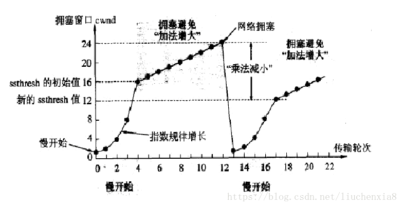

拥塞控制是TCP在传输时尽可能快的将数据传输，并且避免拥塞造成的一系列问题。是可靠性的保证，同时也是维护了传输的高效性。

## 7. 校验和**（**用于接收端检验整个数据包在传输过程中是否出错**）**

计算方式：在数据传输的过程中，将发送的数据段都当做一个16位的整数。将这些整数加起来。并且前面的进位不能丢弃，补在后面，最后取反，得到校验和。 

发送方：在发送数据之前计算检验和，并进行校验和的填充。 

接收方：收到数据后，对数据以同样的方式进行计算，求出校验和，与发送方的进行比对。

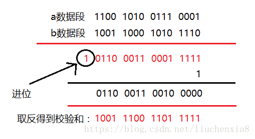

注意：如果接收方比对校验和与发送方不一致，那么数据一定传输有误。但是如果接收方比对校验和与发送方一致，数据不一定传输成功。

## **TCP与UDP的区别：**

1.基于连接与无连接；

2.对系统资源的要求（TCP较多，UDP少）；

3.UDP程序结构较简单；

4.流模式与数据报模式 ；

5.TCP保证数据正确性，UDP可能丢包，TCP保证数据顺序，UDP不保证。

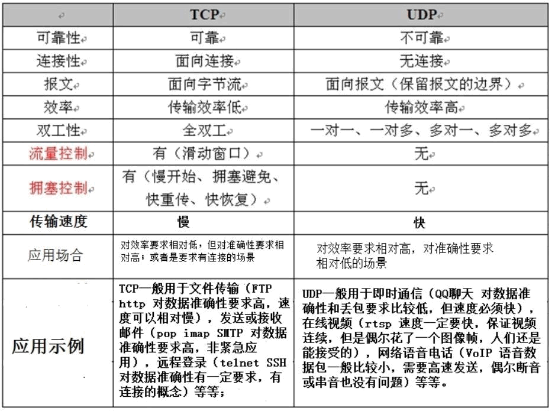

**对应的协议不同** 

**TCP** 对应的协议: 

(1) **FTP**:定义了文件传输协议，使用 21 端口。常说某某计算机开了 FTP 服务便是启动了文件传 输服务。下载文件，上传主页，都要用到 FTP 服务。 

2)**Telnet** :它是一种用于远程登录的端口，用户可以以自己的身份远程连接到计算机上，种端口可以提供一种基于 DOS 模式下的通信服务。如以前的 BBS 是-纯字符界面的，支持 BBS 的服 务器将 23 端口打开，对外提供服务。 

(3) **SMTP**:定义了简单邮件传送协议，现在很多邮件服务器都用的是这个协议，用于发送邮件。 如常见的免费邮件服务中用的就是这个邮件服务端口，所以在电子邮件设置-中常看到有这么 SMTP 端口设置这个栏，服务器开放的是 25 号端口。 

(4) **POP3**:它是和 SMTP 对应，POP3 用于接收邮件。通常情况下，POP3 协议所用的是 110 端 口。也是说，只要你有相应的使用 POP3 协议的程序(例如 Fo-xmail 或 Outlook)，就可以不以 We b 方式登陆进邮箱界面，直接用邮件程序就可以收到邮件(如是 163 邮箱就没有必要先进入网易网站， 再进入自己的邮-箱来收信)。 

(5)**HTTP 协议**:是从 Web 服务器传输超文本到本地浏览器的传送协议。 

**UDP** 对应的协议: 

(1) **DNS**:用于域名解析服务，将域名地址转换为 IP 地址。DNS 用的是 53 号端口。 

(2) **SNMP**:简单网络管理协议，使用 161 号端口，是用来管理网络设备的。由于网络设备很多， 无连接的服务就体现出其优势。 

(3)**TFTP**(Trival File Transfer Protocal)，简单文件传输协议，该协议在熟知端口69上使用UDP 服务。
